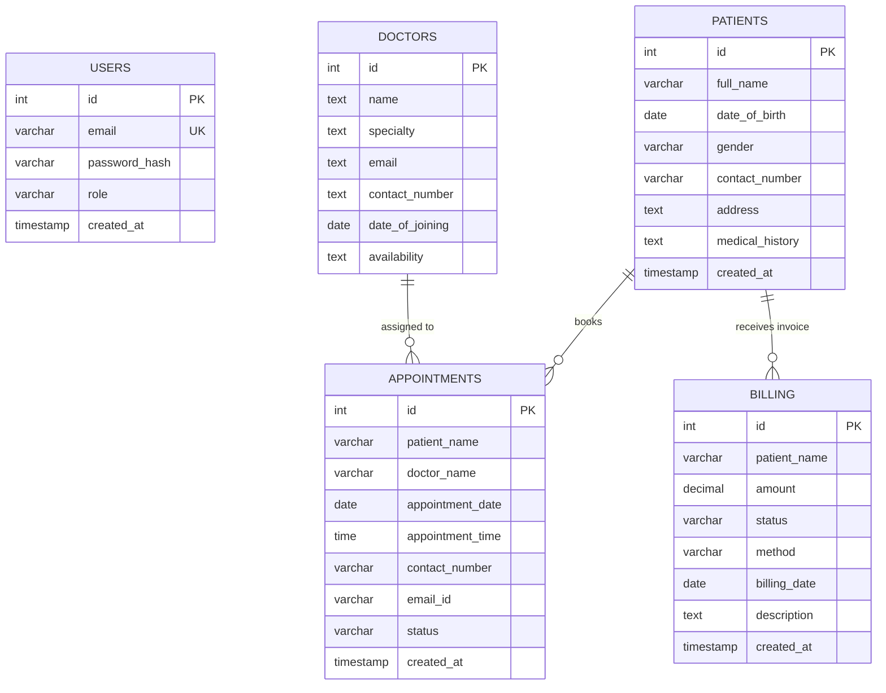
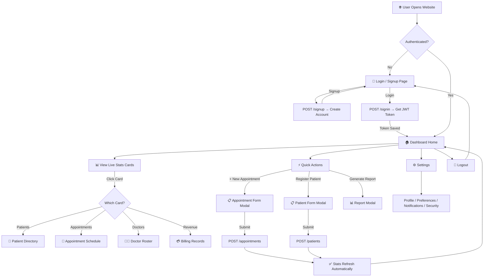
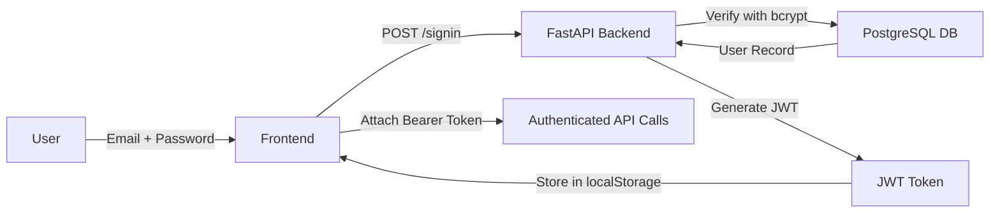
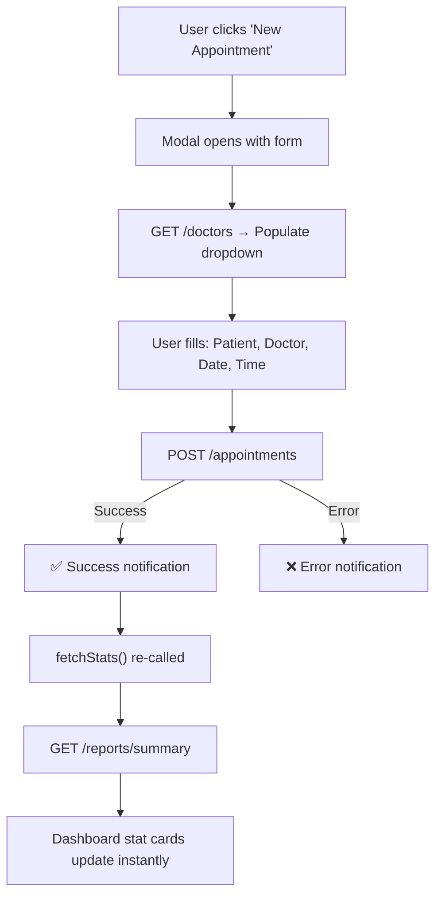

# 🏥 Hospital Management System — Project Report

---

## 1. Project Overview

| Field | Details |
|---|---|
| **Project Title** | Hospital Management System |
| **Project Type** | Full-Stack Web Application |
| **Domain** | Healthcare / Hospital Administration |
| **Developer** | Sahana |
| **Date** | March 2026 |
| **Live URL (Frontend)** | https://hospitalmanagement-phi.vercel.app |
| **Live URL (Backend API)** | https://hospital-management-api-7tat.onrender.com |
| **Source Code** | https://github.com/sahanasahana21439-collab/Hospital_Management |

### 1.1 Problem Statement

Hospitals and healthcare institutions manage vast amounts of patient data, doctor schedules, appointment records, and billing information. Traditional manual or paper-based systems are error-prone, inefficient, and lack real-time insights. There is a critical need for a centralized, web-based system that digitizes and automates hospital administration workflows.

### 1.2 Objective

To design and develop a secure, cloud-hosted, full-stack Hospital Management System that enables administrators to:
- Register and manage patient records digitally
- Schedule and track appointments in real-time
- Maintain a directory of doctors and their availability
- Generate billing invoices and track revenue
- Generate analytical reports for decision making
- Configure system settings and preferences

### 1.3 Scope

- Web-based dashboard accessible from any browser
- Role-based authentication (Admin/Patient)
- CRUD operations for Patients, Doctors, Appointments, and Billing
- Real-time dashboard with live statistics from the database
- Light/Dark theme support
- Responsive design for desktop and tablet screens
- Cloud deployment with CI/CD pipeline

---

## 2. Architecture Details

### 2.1 System Architecture

The system follows a **3-Tier Client-Server Architecture**:

```
┌─────────────────────────────────────────────────────────────────┐
│                        PRESENTATION TIER                        │
│              (Next.js Frontend on Vercel Cloud)                 │
│                                                                 │
│  ┌──────────┐ ┌──────────┐ ┌──────────┐ ┌──────────────────┐   │
│  │Dashboard │ │ Patient  │ │ Doctor   │ │ Appointment/     │   │
│  │  View    │ │  Module  │ │  Module  │ │ Billing/Settings │   │
│  └────┬─────┘ └────┬─────┘ └────┬─────┘ └───────┬──────────┘   │
│       │             │            │                │              │
│       └─────────────┴────────────┴────────────────┘              │
│                          │                                       │
│                    REST API Calls                                │
│                   (HTTPS / JSON)                                 │
└──────────────────────────┬───────────────────────────────────────┘
                           │
                           ▼
┌─────────────────────────────────────────────────────────────────┐
│                       APPLICATION TIER                           │
│               (FastAPI Backend on Render Cloud)                  │
│                                                                 │
│  ┌──────────┐ ┌──────────┐ ┌──────────┐ ┌──────────────────┐   │
│  │Auth API  │ │Patient   │ │Doctor    │ │ Appointment/     │   │
│  │(JWT)     │ │  API     │ │  API     │ │ Billing/Report   │   │
│  └────┬─────┘ └────┬─────┘ └────┬─────┘ └───────┬──────────┘   │
│       │             │            │                │              │
│       └─────────────┴────────────┴────────────────┘              │
│                          │                                       │
│                    SQL Queries                                   │
│                  (psycopg2 Driver)                               │
└──────────────────────────┬───────────────────────────────────────┘
                           │
                           ▼
┌─────────────────────────────────────────────────────────────────┐
│                         DATA TIER                               │
│              (Neon PostgreSQL Cloud Database)                    │
│                                                                 │
│  ┌──────────┐ ┌──────────┐ ┌──────────┐ ┌──────────────────┐   │
│  │ users    │ │ patients │ │ doctors  │ │ appointments /   │   │
│  │ table    │ │  table   │ │  table   │ │ billing tables   │   │
│  └──────────┘ └──────────┘ └──────────┘ └──────────────────┘   │
└─────────────────────────────────────────────────────────────────┘
```

### 2.2 Architecture Pattern

| Pattern | Description |
|---|---|
| **Client-Server** | Frontend (client) communicates with Backend (server) via REST APIs |
| **MVC Pattern** | Model (DB Schema) → Controller (FastAPI Endpoints) → View (React Components) |
| **Single Page Application (SPA)** | Frontend renders all views within a single dashboard page using component switching |
| **Stateless API** | Backend uses JWT tokens for authentication; no server-side sessions |

---

## 3. Technology Stack (Apps & Tools Used)

### 3.1 Frontend

| Technology | Purpose | Version |
|---|---|---|
| **Next.js** | React-based framework for server-side rendering and routing | 15.x |
| **React.js** | Component-based UI library | 19.x |
| **CSS3 / Custom CSS** | Styling, theming, animations, and responsive design | — |
| **JavaScript (ES6+)** | Frontend logic and event handling | ES2020+ |
| **Vercel** | Cloud hosting and CI/CD deployment for frontend | — |

### 3.2 Backend

| Technology | Purpose | Version |
|---|---|---|
| **Python** | Backend programming language | 3.11+ |
| **FastAPI** | High-performance async REST API framework | ≥ 0.110.0 |
| **Uvicorn** | ASGI server for running FastAPI | ≥ 0.29.0 |
| **Pydantic** | Data validation and serialization | v2 |
| **Render** | Cloud hosting and CI/CD deployment for backend | — |

### 3.3 Database

| Technology | Purpose | Version |
|---|---|---|
| **PostgreSQL** | Relational database management system | 16 |
| **Neon** | Serverless cloud-hosted PostgreSQL provider | — |
| **psycopg2-binary** | Python PostgreSQL adapter | ≥ 2.9.9 |

### 3.4 Security & Authentication

| Technology | Purpose | Version |
|---|---|---|
| **JWT (JSON Web Tokens)** | Stateless user authentication | PyJWT ≥ 2.8.0 |
| **bcrypt** | Password hashing and verification | ≥ 4.0.0 |
| **CORS Middleware** | Cross-Origin Resource Sharing protection | Built-in FastAPI |

### 3.5 Development & DevOps Tools

| Tool | Purpose |
|---|---|
| **Git** | Version control |
| **GitHub** | Remote repository and CI/CD trigger |
| **VS Code** | Code editor / IDE |
| **npm** | Node.js package manager |
| **pip** | Python package manager |

---

## 4. Project Folder Structure

```
Hospital_Management/
│
├── frontend/                          # Next.js Frontend Application
│   ├── src/
│   │   ├── app/
│   │   │   ├── page.js                # Landing + Login/Signup Page
│   │   │   ├── layout.js              # Root layout with ThemeProvider
│   │   │   ├── globals.css            # Global styles, themes, animations
│   │   │   └── dashboard/
│   │   │       └── page.js            # Main Dashboard (SPA Controller)
│   │   ├── components/
│   │   │   ├── RegisterPatient.js     # Patient registration form modal
│   │   │   ├── NewAppointment.js      # Appointment scheduling form modal
│   │   │   ├── GenerateReport.js      # Report generation & analytics modal
│   │   │   ├── PatientList.js         # Patient directory with search
│   │   │   ├── DoctorList.js          # Doctor directory with search
│   │   │   ├── AppointmentList.js     # Appointment schedule with search
│   │   │   ├── BillingList.js         # Billing invoice list with search
│   │   │   ├── SettingsView.js        # System settings & preferences
│   │   │   └── ThemeToggle.js         # Light/Dark mode toggle button
│   │   └── context/
│   │       └── ThemeContext.js         # Theme state management (React Context)
│   ├── public/                        # Static assets
│   └── package.json                   # Frontend dependencies
│
├── backend/                           # FastAPI Backend Application
│   ├── main.py                        # API endpoints, database init, auth logic
│   ├── requirements.txt               # Python dependencies
│   ├── .env                           # Environment variables (DB URL, JWT Secret)
│   └── apply_schema.py                # Database schema migration script
│
├── db/                                # Database Scripts
│   ├── schema.sql                     # SQL schema definitions
│   └── README.md                      # Database documentation
│
├── .gitignore                         # Git ignore rules
└── PROJECT_TRACKER.md                 # Development progress tracker
```

---

## 5. Database Schema (ER Diagram)

### 5.1 Entity-Relationship Diagram



### 5.2 Table Definitions

#### `users` — System Authentication

| Column | Type | Constraints | Description |
|---|---|---|---|
| id | SERIAL | PRIMARY KEY | Auto-increment user ID |
| email | VARCHAR(255) | UNIQUE, NOT NULL | User login email |
| password_hash | VARCHAR(255) | NOT NULL | bcrypt hashed password |
| role | VARCHAR(50) | DEFAULT 'patient' | User role (admin/patient) |
| created_at | TIMESTAMP | DEFAULT NOW() | Account creation date |

#### `patients` — Patient Records

| Column | Type | Constraints | Description |
|---|---|---|---|
| id | SERIAL | PRIMARY KEY | Auto-increment patient ID |
| full_name | VARCHAR(255) | NOT NULL | Patient's full name |
| date_of_birth | DATE | NOT NULL | Date of birth |
| gender | VARCHAR(20) | — | Male / Female / Other |
| contact_number | VARCHAR(20) | — | Phone number |
| address | TEXT | — | Residential address |
| medical_history | TEXT | — | Past medical conditions |
| created_at | TIMESTAMP | DEFAULT NOW() | Registration date |

#### `doctors` — Doctor Directory

| Column | Type | Constraints | Description |
|---|---|---|---|
| id | SERIAL | PRIMARY KEY | Auto-increment doctor ID |
| name | TEXT | NOT NULL | Doctor's full name |
| specialty | TEXT | NOT NULL | Medical specialization |
| email | TEXT | — | Professional email |
| contact_number | TEXT | — | Phone number |
| date_of_joining | DATE | DEFAULT TODAY | Joining date |
| availability | TEXT | DEFAULT 'Available' | Current status |

#### `appointments` — Appointment Schedule

| Column | Type | Constraints | Description |
|---|---|---|---|
| id | SERIAL | PRIMARY KEY | Auto-increment appointment ID |
| patient_name | VARCHAR(255) | NOT NULL | Linked patient name |
| doctor_name | VARCHAR(255) | NOT NULL | Assigned doctor name |
| appointment_date | DATE | NOT NULL | Scheduled date |
| appointment_time | TIME | NOT NULL | Scheduled time |
| contact_number | VARCHAR(20) | — | Patient contact |
| email_id | VARCHAR(255) | — | Patient email |
| status | VARCHAR(50) | DEFAULT 'Scheduled' | Scheduled / Completed / Cancelled |
| created_at | TIMESTAMP | DEFAULT NOW() | Booking timestamp |

#### `billing` — Financial Records

| Column | Type | Constraints | Description |
|---|---|---|---|
| id | SERIAL | PRIMARY KEY | Auto-increment invoice ID |
| patient_name | VARCHAR(255) | NOT NULL | Billed patient name |
| amount | DECIMAL(10,2) | NOT NULL | Invoice amount (₹) |
| status | VARCHAR(50) | DEFAULT 'Pending' | Paid / Pending / Overdue |
| method | VARCHAR(50) | DEFAULT 'Cash' | Cash / Card / Insurance |
| billing_date | DATE | DEFAULT TODAY | Invoice date |
| description | TEXT | — | Service description |
| created_at | TIMESTAMP | DEFAULT NOW() | Record creation date |

---

## 6. API Endpoints (Backend Code Details)

### 6.1 Endpoint Summary

| Method | Endpoint | Description | Auth Required |
|---|---|---|---|
| GET | `/` | API health message | No |
| GET | `/health` | Health check | No |
| GET | `/db-test` | Database connectivity test | No |
| POST | `/signup` | Register new user account | No |
| POST | `/signin` | Login and receive JWT token | No |
| POST | `/patients` | Register a new patient | Yes |
| GET | `/patients` | Fetch all patient records | Yes |
| GET | `/doctors` | Fetch all doctor records | Yes |
| POST | `/appointments` | Schedule a new appointment | Yes |
| GET | `/appointments` | Fetch all appointments | Yes |
| GET | `/billing` | Fetch all billing records | Yes |
| GET | `/reports/summary` | Get real-time analytics summary | Yes |

### 6.2 Authentication Flow

```
┌──────────┐        POST /signup          ┌──────────────┐
│  User    │ ──────────────────────────►  │   FastAPI    │
│ (Browser)│   { email, password }        │   Backend    │
│          │ ◄──────────────────────────  │              │
│          │   { message: "Created" }     │  ┌────────┐  │
│          │                              │  │ bcrypt │  │
│          │        POST /signin          │  │ hash   │  │
│          │ ──────────────────────────►  │  └────────┘  │
│          │   { email, password }        │              │
│          │ ◄──────────────────────────  │  ┌────────┐  │──── PostgreSQL
│          │   { access_token: "JWT" }    │  │  JWT   │  │     (Neon)
│          │                              │  │ encode │  │
│          │   GET /patients              │  └────────┘  │
│          │   (Authorization: Bearer)    │              │
│          │ ──────────────────────────►  │              │
│          │ ◄──────────────────────────  │              │
│          │   [ patient_data ]           │              │
└──────────┘                              └──────────────┘
```

### 6.3 Key Backend Dependencies

| Package | Purpose |
|---|---|
| `fastapi>=0.110.0` | Web framework for building REST APIs |
| `uvicorn[standard]>=0.29.0` | ASGI server to serve FastAPI |
| `psycopg2-binary>=2.9.9` | PostgreSQL database adapter for Python |
| `python-dotenv>=1.0.0` | Load environment variables from `.env` |
| `bcrypt>=4.0.0` | Password hashing library |
| `PyJWT>=2.8.0` | JSON Web Token encoding/decoding |

---

## 7. Frontend Component Details

### 7.1 Component Architecture

```
                          ┌──────────────────────┐
                          │     layout.js         │
                          │   (ThemeProvider)      │
                          └──────────┬─────────────┘
                                     │
                    ┌────────────────┴────────────────┐
                    │                                 │
           ┌────────▼────────┐             ┌─────────▼────────┐
           │    page.js      │             │  dashboard/       │
           │ (Login/Signup)  │             │   page.js         │
           │                 │             │ (Main Dashboard)  │
           └─────────────────┘             └────────┬──────────┘
                                                    │
                    ┌───────────────────────────────┼───────────────────┐
                    │                               │                   │
         ┌──────────▼──────────┐       ┌────────────▼───────┐  ┌───────▼────────┐
         │   Sidebar (Tabs)    │       │   Stats Grid       │  │  Quick Actions │
         │                     │       │  (Live from API)   │  │                │
         │ • Dashboard         │       └────────────────────┘  │ • + Appointment│
         │ • Patients          │                               │ • Register     │
         │ • Doctors           │       ┌────────────────────┐  │ • Report       │
         │ • Appointments      │       │  Content Renderer  │  └────────────────┘
         │ • Billing           │       │  (Tab Switching)   │
         │ • Settings ⚙️       │       │                    │
         │ • Logout 🚪         │       │  ┌──────────────┐  │
         └─────────────────────┘       │  │ PatientList  │  │
                                       │  │ DoctorList   │  │
                                       │  │ Appt.List    │  │
                                       │  │ BillingList  │  │
                                       │  │ SettingsView │  │
                                       │  └──────────────┘  │
                                       └────────────────────┘

         ┌─────────────────────────────────────────────────────┐
         │                   Modal Overlays                    │
         │  ┌────────────────┐ ┌──────────────┐ ┌──────────┐  │
         │  │RegisterPatient │ │NewAppointment│ │GenReport │  │
         │  └────────────────┘ └──────────────┘ └──────────┘  │
         └─────────────────────────────────────────────────────┘
```

### 7.2 Component Descriptions

| Component | File | Description |
|---|---|---|
| **Login / Signup** | `page.js` | Dual-mode authentication form with animated toggle |
| **Dashboard** | `dashboard/page.js` | Main SPA controller with sidebar, stats, and tab routing |
| **PatientList** | `PatientList.js` | Searchable patient directory table with View Details |
| **DoctorList** | `DoctorList.js` | Searchable doctor roster showing specialty & availability |
| **AppointmentList** | `AppointmentList.js` | Full appointment schedule with 7-column table layout |
| **BillingList** | `BillingList.js` | Invoice management with revenue summary cards |
| **RegisterPatient** | `RegisterPatient.js` | Modal form to add new patient records |
| **NewAppointment** | `NewAppointment.js` | Modal form to schedule appointments with doctor selection |
| **GenerateReport** | `GenerateReport.js` | Analytics modal showing summary statistics |
| **SettingsView** | `SettingsView.js` | Enterprise-grade settings panel (Profile, Preferences, Notifications, Security) |
| **ThemeToggle** | `ThemeToggle.js` | Light/Dark mode switch with localStorage persistence |
| **ThemeContext** | `ThemeContext.js` | React Context for global theme state management |

---

## 8. Application Flowchart

### 8.1 Overall User Flow



### 8.2 Authentication Flow



### 8.3 Appointment Booking Flow



---

## 9. Data Flow Diagram

### 9.1 Level 0 — Context Diagram

```
                    ┌─────────────────────────────┐
                    │                             │
   Patient Data     │                             │    Reports &
   Appointments ───►│   Hospital Management       │───► Statistics
   Billing Info     │        System               │    Invoices
                    │                             │    Analytics
   Login/Signup ───►│                             │───► JWT Token
                    │                             │
                    └─────────────────────────────┘
                              ▲         │
                              │         │
                              │         ▼
                    ┌─────────────────────────────┐
                    │   PostgreSQL Database        │
                    │   (Neon Cloud)               │
                    └─────────────────────────────┘
```

### 9.2 Level 1 — Detailed Data Flow

```
┌─────────────────────────────────────────────────────────────────────────┐
│                              FRONTEND                                  │
│                                                                        │
│  ┌──────────────┐    ┌──────────────┐    ┌──────────────────────────┐  │
│  │ Auth Module   │    │ Dashboard    │    │ Form Modals              │  │
│  │              │    │ Stats Grid   │    │ (Patient/Appt/Report)    │  │
│  │ • Login form │    │ • 4 Cards    │    │ • Input validation       │  │
│  │ • Signup form│    │ • Appt Table │    │ • API submission         │  │
│  └──────┬───────┘    └──────┬───────┘    └───────────┬──────────────┘  │
│         │                   │                        │                 │
│     JWT Token         GET /reports/summary     POST /patients         │
│     localStorage      GET /appointments        POST /appointments     │
│                       GET /patients                                    │
│                       GET /doctors                                     │
│                       GET /billing                                     │
└─────────┬───────────────────┬────────────────────────┬─────────────────┘
          │                   │                        │
          ▼                   ▼                        ▼
┌─────────────────────────────────────────────────────────────────────────┐
│                              BACKEND (FastAPI)                         │
│                                                                        │
│  ┌──────────────┐    ┌──────────────┐    ┌──────────────────────────┐  │
│  │ Auth Service  │    │ Query Service│    │ Mutation Service         │  │
│  │              │    │              │    │                          │  │
│  │ • /signup    │    │ • /patients  │    │ • POST /patients         │  │
│  │ • /signin    │    │ • /doctors   │    │ • POST /appointments     │  │
│  │ • bcrypt     │    │ • /billing   │    │                          │  │
│  │ • JWT encode │    │ • /reports   │    │                          │  │
│  └──────┬───────┘    └──────┬───────┘    └───────────┬──────────────┘  │
│         │                   │                        │                 │
│      SQL INSERT          SQL SELECT              SQL INSERT            │
│      SQL SELECT                                                        │
└─────────┬───────────────────┬────────────────────────┬─────────────────┘
          │                   │                        │
          ▼                   ▼                        ▼
┌─────────────────────────────────────────────────────────────────────────┐
│                          DATABASE (Neon PostgreSQL)                     │
│                                                                        │
│  ┌──────────┐  ┌──────────┐  ┌──────────┐  ┌──────────┐  ┌─────────┐ │
│  │  users   │  │ patients │  │ doctors  │  │ appoint- │  │ billing │ │
│  │          │  │          │  │          │  │  ments   │  │         │ │
│  └──────────┘  └──────────┘  └──────────┘  └──────────┘  └─────────┘ │
└─────────────────────────────────────────────────────────────────────────┘
```

---

## 10. Security Implementation

| Feature | Implementation |
|---|---|
| **Password Hashing** | bcrypt with auto-generated salt (never stored in plain text) |
| **Authentication** | JWT (JSON Web Tokens) with 60-minute expiry |
| **CORS Protection** | FastAPI CORS Middleware restricting to known frontend origins |
| **SQL Injection Prevention** | Parameterized queries using psycopg2 `%s` placeholders |
| **Environment Variables** | Sensitive data (DB URL, JWT Secret) stored in `.env` file, not hardcoded |
| **HTTPS** | All cloud services (Vercel, Render, Neon) communicate over TLS/SSL |

---

## 11. Deployment Pipeline (CI/CD)

### 11.1 Deployment Architecture

```
┌────────────────┐      git push       ┌────────────────┐
│   Developer    │ ──────────────────► │    GitHub       │
│   (VS Code)   │                      │   Repository   │
└────────────────┘                      └───────┬────────┘
                                                │
                                     ┌──────────┴──────────┐
                                     │                     │
                              Auto-Deploy            Auto-Deploy
                              (Webhook)              (Webhook)
                                     │                     │
                                     ▼                     ▼
                           ┌─────────────────┐  ┌─────────────────┐
                           │    Vercel        │  │    Render        │
                           │   (Frontend)     │  │   (Backend)      │
                           │                  │  │                  │
                           │  Next.js Build   │  │  pip install     │
                           │  Static + SSR    │  │  uvicorn start   │
                           └────────┬─────────┘  └────────┬─────────┘
                                    │                     │
                                    │                     │
                                    ▼                     ▼
                           hospitalmanagement    hospital-management
                           -phi.vercel.app      -api-7tat.onrender.com
                                    │                     │
                                    └──────────┬──────────┘
                                               │
                                               ▼
                                    ┌─────────────────────┐
                                    │   Neon PostgreSQL    │
                                    │   (Cloud Database)   │
                                    │   us-west-2 (AWS)    │
                                    └─────────────────────┘
```

### 11.2 Deployment Steps

| Step | Action | Platform |
|---|---|---|
| 1 | Developer pushes code to `main` branch | GitHub |
| 2 | Vercel auto-detects push, builds Next.js frontend | Vercel |
| 3 | Render auto-detects push, installs dependencies, starts uvicorn | Render |
| 4 | Frontend fetches data from Backend API over HTTPS | Vercel → Render |
| 5 | Backend queries Neon PostgreSQL database | Render → Neon |

---

## 12. Key Features Summary

| # | Feature | Description |
|---|---|---|
| 1 | **User Authentication** | Secure signup/login with bcrypt hashing and JWT tokens |
| 2 | **Patient Management** | Register, view, and search patient records |
| 3 | **Doctor Directory** | View doctor roster with specialty and availability status |
| 4 | **Appointment Scheduling** | Book appointments with doctor selection and time slots |
| 5 | **Billing Management** | Track invoices with payment status and revenue summary |
| 6 | **Report Generation** | Analytical dashboard with real-time summary statistics |
| 7 | **Settings Panel** | Profile, app preferences, notifications, and security configuration |
| 8 | **Real-Time Dashboard** | Live stat cards that auto-update when data changes |
| 9 | **Theme Toggle** | Persistent light/dark mode with CSS variable theming |
| 10 | **Search & Filter** | Real-time search across patients, doctors, appointments, and billing |
| 11 | **Currency Localization** | Revenue displayed in Indian Rupees (₹) with proper formatting |
| 12 | **Responsive Design** | Premium UI optimized for desktop and tablet screens |

---

## 13. Screenshots Reference

| Screen | Description |
|---|---|
| Landing Page | Login/Signup with animated toggle and gradient background |
| Dashboard Home | Stats grid + recent appointments + quick actions |
| Patient Directory | Searchable patient table with initials and action buttons |
| Doctor Roster | Doctor cards with specialty, availability badges |
| Appointment Schedule | 7-column table (Patient, Doctor, Date, Time, Status, Contact, Email) |
| Billing Records | Invoice list with revenue summary cards (Paid/Pending/Overdue) |
| Report Generation | Modal with real-time analytics from database |
| Settings Page | Bordered list panels — Profile, Preferences, Notifications, Security |
| Dark/Light Mode | Complete theme switch preserving all visual elements |

---

## 14. Future Enhancements

| Enhancement | Description |
|---|---|
| **Role-Based Access Control** | Restrict modules based on user roles (Admin, Doctor, Receptionist) |
| **Email Notifications** | Send appointment reminders and billing alerts via SMTP |
| **PDF Export** | Generate downloadable PDF reports and invoices |
| **Audit Logging** | Track all user actions for compliance (HIPAA) |
| **Mobile App** | React Native companion app for doctors and patients |
| **AI Chatbot** | Integrate an AI assistant for patient queries and appointment booking |
| **Dashboard Charts** | Add interactive graphs (bar, pie, line) for trend analytics |

---

## 15. Conclusion

The Hospital Management System is a fully functional, cloud-deployed web application that digitizes core hospital administrative workflows. Built with a modern technology stack (Next.js, FastAPI, PostgreSQL) and deployed on industry-standard cloud platforms (Vercel, Render, Neon), the system demonstrates best practices in full-stack development, including secure authentication, real-time data synchronization, responsive UI design, and automated CI/CD deployment.

The application successfully achieves its objectives of providing an intuitive, secure, and efficient platform for managing patients, doctors, appointments, billing, and system settings — ready for real-world hospital administration use.

---

**Prepared by:** Sahana  
**Date:** March 2026  
**Project Repository:** [GitHub - Hospital_Management](https://github.com/sahanasahana21439-collab/Hospital_Management)
